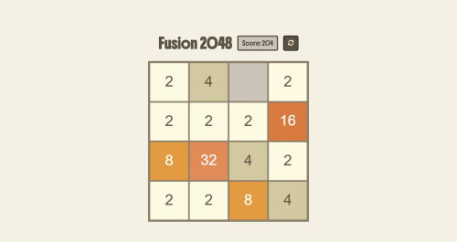
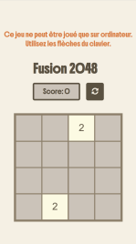

#  Jeu Fusion 2048 


Fusion 2048 est une version du jeu original 2048. 

**Règle du jeu:** 
- Il convient d'utiliser les touches fléchées du clavier (haut, bas, gauche, droite) pour déplacer les tuiles dans la direction choisie.
- Lorsque deux tuiles de même valeur se touchent, elles fusionnent en une seule tuile dont la valeur est la somme des deux.
- Après chaque mouvement, une nouvelle tuile de valeur 2 ou 4 apparaît aléatoirement sur la grille.
- Le jeu se termine lorsque la grille est pleine et qu'aucun mouvement n'est possible.
- L'objectif est d'atteindre la tuile 2048 et d'obtenir le score le plus élevé possible.

Jeu codé en JavaScript et déployé sur Netlify: **[jouer en ligne à Fusion 2048](https://fusion2048-game.netlify.app/)**

⚠️ **Ce jeu est optimisé pour ordinateur** et nécessite l'utilisation des flèches du clavier. Il n'est pas compatible avec les appareils mobiles ou tablettes.

---

## Aperçu 

<span style="display: flex;">
 
 
</span>

---

## 1. Installation 

```
git clone `https://github.com/Melissa-code/fusion_2048.git`
cd fusion_2048
```
- Ouvrir le fichier index.html dans le navigateur pour commencer à jouer
---

## 2. Technologies 

- **[HTML](https://developer.mozilla.org/fr/docs/Web/HTML)** : structure du jeu
- **[CSS](https://developer.mozilla.org/fr/docs/Web/CSS)** : design et mise en page
- **[JavaScript](https://developer.mozilla.org/fr/docs/Web/JavaScript)** : logique du jeu 
- **[Canvas API](https://developer.mozilla.org/en-US/docs/Web/API/Canvas_API)** : rendu du jeu
---

## 3. Architecture et Pattern

### 3.1. Architecture

```
📂 fusion_2048
┣ 📜 index.html → structure du jeu
┣ 📜 style.css → styles 
┣ 📂 model → contient les classes du jeu et les enums
│ ┣ 📜 Game.js → représente le jeu
│ ┣ 📜 Colors.js → énumère les couleurs 
│ ┣ 📜 NumerosColors.js → énumère les numéros en fonction des couleurs 
│ ┣ 📜 Directions.js → énumère les directions
┣ 📜 Vue.js → gère l'affichage du jeu 
┗ 📜 controller.js → Point d’entrée: initialise le jeu et la logique principale
┗ 📜 assets/images → contient les images du jeu
```

### 3.2. Pattern

Le projet suit un **pattern MVC** séparant la logique du jeu pour améliorer la maintenabilité et l'extensibilité du code: 

Séparation claire des responsabilités:
  - `model/` contient la logique du jeu (Modèle) 
  - `View.js` gère l'affichage et l'interface utilisateur (Vue)
  - `controller.js` relie la logique du jeu et l'affichage en gérant les interactions (Contrôleur)

---

## 4. Fonctionnalités principales

- Grille de jeu 4x4
- Génération aléatoire de nouvelles tuiles:
  - 90% chance pour un 2
  - 10% chance pour un 4
- Système de score basé sur les valeurs des tuiles fusionnées
- Détection automatique de fin de partie
- Possibilité de recommencer une partie à tout moment
- Interface utilisateur simple et intuitive utilisant l'API Canvas pour le rendu graphique
- Animation des déplacements et des fusions de tuiles

## 5. Algorithmique du jeu

Fusion 2048 est basé sur plusieurs concepts algorithmiques

#### 5.1. Structure de données

- Utilisation d'une matrice 4x4 pour représenter la grille de jeu
- Gestion des déplacements par manipulation de tableaux
- Utilisation d'énumérations (enums) pour améliorer la lisibilité du code et en faciliter la maintenance. 

#### 5.2. Utilisation des enums

- Le jeu utilise des énumérationspour améliorer la lisibilité du code et en faciliter la maintenance 

#### 5.3. Rendu graphique avec Canvas API

- La classe View utilise l'API Canvas HTML pour le rendu graphique, ce qui permet un contrôle précis sur le rendu graphique et offre de bonnes performances pour les animations

#### 5.4. Logique de mouvement

- Pour chaque direction (haut, bas, gauche, droite), les valeurs non nulles sont extraites de la ligne/colonne

- L'algorithme de fusion est appliqué pour combiner les tuiles identiques adjacentes

- Les valeurs fusionnées sont replacées dans la grille en tenant compte de la direction

#### 5.5. Algorithme de fusion

- La méthode `fusion()` est le cœur du jeu:

  - Elle prend un tableau de nombres comme entrée
  - Elle parcourt ce tableau et combine les valeurs identiques consécutives
  - Elle retourne un nouveau tableau avec les valeurs fusionnées et complété par des zéros

#### 5.6. Génération aléatoire

- Génération de nouvelles tuiles (valeur 2 ou 4) à des positions aléatoires vides

- Probabilité pondérée: 90% pour une tuile de valeur 2 contre 10% pour une tuile de valeur 4

#### 5.7 Détection de fin de partie

- Vérification si la grille est complètement remplie

- Le jeu se termine lorsqu'aucune case vide n'est disponible et qu'aucune fusion n'est possible

## 6. Conclusion et objectif pédagogique

Le développement de ce jeu permet de voir plusieurs concepts fondamentaux en programmation et algorithmique :

- **Manipulation de matrices**: le jeu repose entièrement sur la manipulation d'une matrice 2D

- **Algorithmes de traitement de données**: l'algorithme de fusion illustre bien le traitement séquentiel des données

- **Génération aléatoire**: utilisée pour placer de nouvelles tuiles à des positions aléatoires

- **Détection d'états**: vérification des conditions de fin de jeu

- **Architecture MVC**: séparation claire entre le modèle (Game.js), la vue (View.js) et le contrôleur

- **Gestion des événements**: utilisation des événements clavier et clic pour interagir avec le jeu

- **Programmation orientée objet**: utilisation de classes pour encapsuler la logique du jeu

- **Énumérations (enums)**: Utilisation d'objets constants pour définir des ensembles de valeurs nommées comme les couleurs des tuiles ce qui améliore la lisibilité du code (code plus compréhensible par des noms significatifs), la maintenance (modification à un seul endroit) et la prévention des erreurs (éviter les erreurs de frappe)

- **Canvas API**: utilisation des fonctionnalités de dessin 2D pour créer l'interface graphique du jeu


---

## 7. Author 

- Melissa-code